### 👋 Hello! I'm Victor 🧑‍💻
Mobile Architect - Flutter, iOS and Android Engineer. A native mobile technology enthusiast. 

- 🔭 I’m currently working as DCX Mobile CTO at [Capgemini](https://www.capgemini.com/).
- 🌱 I'm always learning and discovering any new mobile technology within the Flutter, iOS and Android.
- 👯 I always look forward to working with others on projects that sound exciting and fun.
- 🧑‍🏫 I contribute to different communities as a speaker and trainer in mobile technology.
- 💬 I spread the word about mobile technology on [my personal blog](https://www.victorcarreras.dev/).
- 🕵️ You can find me in any of my social networks linked in my profile.
- 📫 You can reach me in any of them or also through [email](mailto:keys.01yacht@icloud.com?subject=[GitHub]).

##  Most used languages
Keep in mind that in my work schedule I mostly work with private repositories. 

##  GitHub Stats
Keep in mind that in my work schedule I mostly work with private repositories. 

##  Wakatime Stats Card
You can see how much time I spend developing tools, frameworks and mobile applications.

